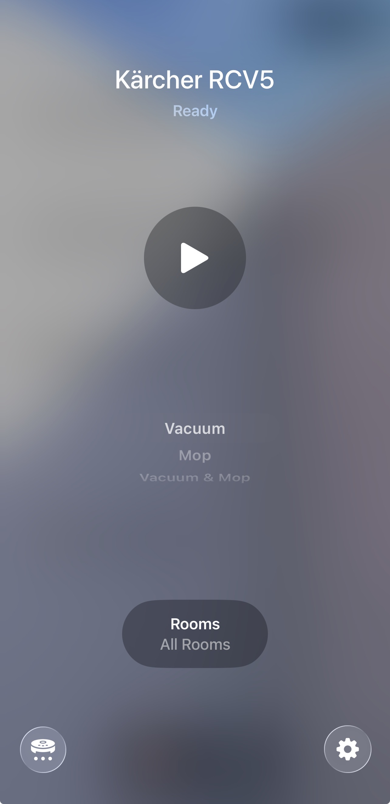

# Kärcher RCV5 — Home Assistant Integration

[](https://hacs.xyz)
[](https://github.com/vosadci/karcher-rcv5-ha/actions/workflows/tests.yml)

> **Considering buying an RCV5?** Read [doc/READ_BEFORE_BUYING.md](doc/READ_BEFORE_BUYING.md) first — it covers Kärcher's marketing claims and what independent investigation found.

> **Personal project** — This is an unofficial, community-built integration. It is not affiliated with or endorsed by Kärcher. It may have bugs, break with cloud updates, or cause unexpected behaviour. Use at your own risk.

A custom [Home Assistant](https://www.home-assistant.io/) integration for the **Kärcher RCV5** robot vacuum, with optional **Apple Home support via Matter**.

There is no official Home Assistant integration and no local API. This integration reverse-engineers the Kärcher cloud protocol (MQTT + REST) to provide real-time control and state updates.



---

## What you get

| Feature | Home Assistant | Apple Home |
|---|---|---|
| Start / Pause / Stop | ✓ | ✓ |
| Return to base (dock) | ✓ | ✓ |
| Battery level | ✓ | ✓ |
| Room selection | ✓ | ✓ |
| Fan speed (Silent / Standard / Medium / Turbo) | ✓ | ✓ |
| Cleaning mode (Vacuum / Vacuum and Mop / Mop) | ✓ | ✓ |
| Mop water level (Low / Medium / High) | ✓ | ✓ |

State updates arrive within ~2 seconds via MQTT push. A 30-second polling fallback is used if MQTT is unavailable.

---

## Requirements

- Home Assistant (tested on 2025.x+)
- A Kärcher Home Robots app account (EU, US, or CN region)
- For Apple Home: [Home Assistant Matter Hub](https://github.com/RiDDiX/home-assistant-matter-hub)

---

## Installation

### Option A — HACS (recommended)

1. In Home Assistant, go to **HACS → Integrations → ⋮ → Custom repositories**
2. Add `https://github.com/vosadci/karcher-rcv5-ha` as an **Integration**
3. Search for **Kärcher** in HACS and install it
4. Restart Home Assistant

### Option B — Manual

Copy `custom_components/karcher_home_robots/` into your HA config directory and restart:

```bash
cp -r custom_components/karcher_home_robots /config/custom_components/
```

---

## Setup

After restarting HA, go to **Settings → Integrations → Add Integration → Kärcher Home Robots** and follow the steps:

1. **Region** — EU, US, or CN
2. **Email and password** — your Kärcher Home Robots app credentials
3. **Device** — select your RCV5 (skipped if only one device is on the account)

The integration connects, subscribes to MQTT push updates, and creates all entities automatically.

---

## Entities

| Entity | Description |
|---|---|
| `vacuum.<name>` | Main vacuum — start, pause, stop, return to base, fan speed |
| `sensor.<name>_battery` | Battery level (%) |
| `sensor.<name>_cleaning_area` | Area cleaned in current session (m²) |
| `sensor.<name>_cleaning_time` | Duration of current cleaning session (min) |
| `binary_sensor.<name>_error` | On when the robot reports a fault |
| `select.<name>_room` | Room to clean — "All rooms" or a specific room |
| `select.<name>_cleaning_mode` | Vacuum / Vacuum and Mop / Mop |
| `select.<name>_water_level` | Mop water level: Low / Medium / High |

Entity IDs use the device nickname from the Kärcher app.

**Room selection:** Rooms are fetched from the robot's stored map at startup. Select a room then press Start to clean only that room. Select "All rooms" to clean everything.

**Cleaning mode and water level:** Set before or during cleaning. Water level only has effect when the mop attachment is physically installed. Fan speed is not available in Mop-only mode.

**Multiple robots:** Each robot is a separate config entry. Run **Add Integration** once per robot. If the robots share the same account, log in with the same credentials and pick a different device each time.

---

## Apple Home via Matter

Apple Home support requires [Home Assistant Matter Hub](https://github.com/RiDDiX/home-assistant-matter-hub) (HAMH). See the HAMH documentation for installation instructions.

### Create the bridge (one-time)

Open the HAMH web UI and create a new bridge:

1. **Name:** anything (e.g. `Kärcher RCV5`)
2. **Server Mode:** enabled
3. **Entity filter:** add your vacuum entity (e.g. `vacuum.karcher_rcv5`)
4. Click the vacuum entity row → set **Matter Device Type** to **Robot Vacuum Cleaner**
5. Set **Cleaning Mode Entity** → `select.<name>_cleaning_mode`
6. Set **Mop Intensity Entity** → `select.<name>_water_level`

### Pair with Apple Home (one-time)

In the HAMH web UI, a Matter QR code is shown. Open the **Home app → Add Accessory → More Options** and scan it.

### What appears in Apple Home

- Start / Stop / Return to Base
- Battery percentage
- Room picker
- Fan speed: Quiet / Automatic / Max
- Cleaning type: Vacuum / Mop / Vacuum and Mop
- Mop intensity: Quiet / Automatic / Max (when mop mode is active)

---

## Acknowledgements

- [`karcher-home`](https://github.com/lafriks/python-karcher) by [@lafriks](https://github.com/lafriks)
- [Home Assistant Matter Hub](https://github.com/RiDDiX/home-assistant-matter-hub) by [@RiDDiX](https://github.com/RiDDiX)
