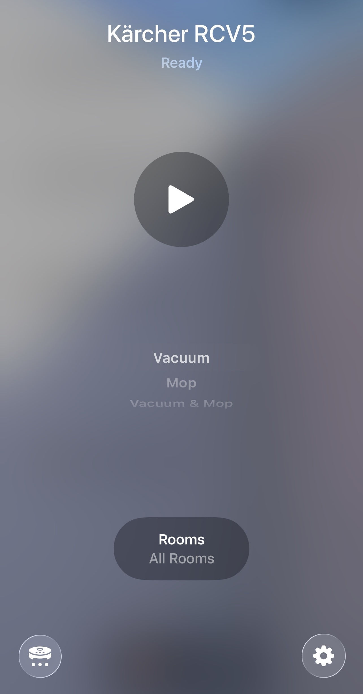

# Kärcher Home Robots — Home Assistant Integration

[](https://hacs.xyz)
[](https://github.com/vosadci/karcher-rcv5-ha/actions/workflows/ci.yml)
[](LICENSE)
[](https://www.home-assistant.io/)

Unofficial community-built integration for the **Kärcher RCV5** robot vacuum. Provides real-time control and state via the same MQTT/REST cloud protocol the official app uses, with optional **Apple Home support via Matter**.

> **Not affiliated with or endorsed by Kärcher or 3iRobotix.** May break with cloud-side changes; use at your own risk.

> **Considering buying an RCV5?** Read [doc/READ_BEFORE_BUYING.md](doc/READ_BEFORE_BUYING.md) first.



---

## Features

| Feature | Home Assistant | Apple Home |
|---|:---:|:---:|
| Start / Pause / Stop | ✓ | ✓ |
| Return to base | ✓ | ✓ |
| Battery level | ✓ | ✓ |
| Locate robot | ✓ | ✓ |
| Room selection | ✓ | ✓ |
| Fan speed (Silent / Standard / Medium / Turbo) | ✓ | ✓ |
| Cleaning mode (Vacuum / Vacuum & Mop / Mop) | ✓ | ✓ |
| Mop water level (Low / Medium / High) | ✓ | ✓ |
| Consumable life sensors (brush, filter, mop pad) | ✓ | — |
| Live floor plan map image | ✓ | — |
| Custom Lovelace card with room-tap UI | ✓ | — |
| Per-room progress rings | — | ✓ |

State updates arrive within ~2 s via MQTT push; a 30 s polling fallback activates when the push channel is silent.

---

## Requirements

- **Home Assistant** 2026.2.3 or newer
- **Kärcher Home Robots app account** — EU, US, or CN region
- **2.4 GHz Wi-Fi** reachable by the vacuum (the firmware does not support 5 GHz)
- **Apple Home** (optional): [Home Assistant Matter Hub](https://github.com/RiDDiX/home-assistant-matter-hub) v2.0.38 or newer and iOS/tvOS 26 or newer

> Earlier versions of these dependencies may work but have not been tested.

---

## Installation

### HACS — Custom Repository (recommended)

1. In Home Assistant, open **HACS → Integrations**.
2. Click the **⋮** menu in the top-right corner and choose **Custom repositories**.
3. Enter `https://github.com/vosadci/karcher-rcv5-ha` and set the category to **Integration**.
4. Search for **Kärcher Home Robots** and click **Download**.
5. Restart Home Assistant.

### Manual

1. Download or clone this repository.
2. Copy the `custom_components/karcher_home_robots/` folder into your Home Assistant configuration directory:

```bash
cp -r custom_components/karcher_home_robots /config/custom_components/
```

3. Restart Home Assistant.

---

## Configuration

After restarting, go to **Settings → Devices & Services → Add Integration** and search for **Kärcher Home Robots**. The setup wizard has three steps:

| Step | What to enter |
|---|---|
| **Region** | EU, US, or CN — must match the region of your Kärcher Home app account |
| **Credentials** | Email and password for your Kärcher Home app account |
| **Device** | Select your RCV5 from the list (skipped if only one device is on the account) |

The integration authenticates, subscribes to MQTT push updates, and creates all entities automatically. No YAML configuration is required.

### Running multiple robots

Each robot requires its own config entry. Run **Add Integration** once per robot. If they share an account, use the same credentials and pick a different device at the last step.

### Reauthentication

Token expiry is handled transparently. A **Reauthentication required** prompt only appears when the password itself is invalid (changed in the app, account locked, etc.). Go to **Settings → Devices & Services → Kärcher Home Robots → Reauthenticate** — region and device selection are preserved.

---

## Entities

| Entity | Description |
|---|---|
| `vacuum.<name>` | Main vacuum — start, pause, stop, dock, locate, fan speed |
| `sensor.<name>_battery` | Battery level (%) |
| `sensor.<name>_cleaning_area` | Area cleaned in the current session (m²) |
| `sensor.<name>_cleaning_time` | Duration of the current cleaning session (min) |
| `sensor.<name>_current_room` | Name of the room the robot is currently cleaning |
| `binary_sensor.<name>_error` | On when the robot reports a fault |
| `select.<name>_room` | Room to clean — "All rooms" or a specific room name |
| `select.<name>_cleaning_mode` | Vacuum / Vacuum & Mop / Mop |
| `select.<name>_water_level` | Mop water level — Low / Medium / High (disabled by default) |
| `sensor.<name>_main_brush` | Main brush remaining life (%) |
| `sensor.<name>_side_brush` | Side brush remaining life (%) |
| `sensor.<name>_hypa` | HEPA filter remaining life (%) |
| `sensor.<name>_mop_life` | Mop pad remaining life (%) |
| `image.<name>_map` | Live floor plan rendered as a PNG |

Entity IDs use the device nickname set in the Kärcher app.

**Room selection.** Rooms are loaded from the robot's stored map at startup. Select a room and press Start to clean only that room; select "All rooms" to clean everything. The room list updates automatically whenever the robot builds a new map.

**Mop attachment gating.** Cleaning modes that require the mop (Vacuum & Mop, Mop) are blocked unless the water tank and mop cloth are both physically installed. The water level selector is unavailable in Vacuum-only mode.

**Diagnostics.** Go to **Settings → Devices & Services → Kärcher Home Robots → ⋮ → Download diagnostics**. The output is automatically redacted of credentials, tokens, device identifiers, and serial numbers.

---

## Lovelace Card

The integration ships a custom map card — no separate HACS step required.

### Register the resource (one-time)

Go to **Settings → Dashboards → ⋮ → Resources → Add resource**:

| Field | Value |
|---|---|
| URL | `/karcher_home_robots/static/karcher-vacuum-card.js` |
| Resource type | JavaScript Module |

Reload the browser tab after saving.

### Add to a dashboard

In the dashboard editor, add a **Manual** card and paste:

```yaml
type: custom:karcher-vacuum-card
vacuum_entity: vacuum.karcher_rcv5
battery_entity: sensor.karcher_rcv5_battery
map_entity: image.karcher_rcv5_map
current_room_entity: sensor.karcher_rcv5_current_room   # optional
cleaning_time_entity: sensor.karcher_rcv5_cleaning_time  # optional
cleaning_area_entity: sensor.karcher_rcv5_cleaning_area  # optional
cleaning_mode_entity: select.karcher_rcv5_cleaning_mode  # optional
water_level_entity: select.karcher_rcv5_water_level     # optional
```

Replace entity IDs with the actual names shown in Home Assistant.

### Card capabilities

- Renders the live floor plan; refreshes automatically when the map updates
- Tap a room to select it (highlights); tap again to deselect — multiple rooms can be selected simultaneously
- **Start** cleans only selected rooms, or all rooms if none are selected
- State-aware control buttons: Play/Pause · Stop · Dock · Locate
- Fan speed and cleaning mode selectors (fan speed is disabled in Mop-only mode)
- Mop water level selector (disabled in Vacuum-only mode; requires `water_level_entity`)
- Battery level, status line, current room, cleaning time and area
- Error banner when the robot reports a fault

---

## Apple Home via Matter

Requires [Home Assistant Matter Hub](https://github.com/RiDDiX/home-assistant-matter-hub) (HAMH) **v2.0.38 or newer** and **iOS/tvOS 26 or newer**.

### Bridge setup (one-time)

In the HAMH web UI, create a new bridge:

1. Give it any name (e.g. `Kärcher RCV5`).
2. Enable **Server Mode**.
3. Add your vacuum entity (e.g. `vacuum.karcher_rcv5`) to the entity filter.
4. Click the vacuum row and set **Matter Device Type** to **Robot Vacuum Cleaner**.
5. Map the optional entities:
   - **Cleaning Mode** → `select.<name>_cleaning_mode`
   - **Mop Intensity** → `select.<name>_water_level`
   - **Current Room** → `sensor.<name>_current_room`

### Pair with Apple Home (one-time)

HAMH shows a Matter QR code. In the **Home** app, tap **Add Accessory → More Options** and scan it.

### What appears in Apple Home

- Start / Stop / Return to Base
- Battery percentage
- Room picker — select one or more rooms before pressing Start
- Fan speed: Quiet / Automatic / Max
- Cleaning type: Vacuum / Mop / Vacuum and Mop
- Mop intensity: Quiet / Automatic / Max (visible when a mop mode is active)
- Per-room progress rings: each selected room shows a spinner while being cleaned, then a filled ring when complete

---

## Known Limitations

- **Cloud-only.** The RCV5 has no local API; all control goes through the 3iRobotix cloud. An internet outage or vendor-side maintenance will make the robot unreachable from Home Assistant.
- **One robot per config entry.** Multi-robot accounts are supported but require adding the integration once per robot.
- **Map requires a completed clean.** The robot only uploads its floor plan after finishing a full cleaning cycle. Run one complete clean before expecting the map image or room list to appear.
- **2.4 GHz Wi-Fi only.** The RCV5 firmware does not connect to 5 GHz.
- **No schedule management.** Cleaning schedules can only be set in the Kärcher app; they are not exposed as Home Assistant entities.
- **No zone or custom-path cleaning.** Only full-home and per-room modes are supported.

---

## Troubleshooting

**Login fails with the correct password.**
Check the region setting. Accounts are region-bound — an EU account will not authenticate against the US endpoint. If the region is correct, try logging in through the Kärcher Home Robots app to verify the credentials.

**`Reauthentication required` banner appears.**
The saved password is no longer valid. Go to **Settings → Devices & Services → Kärcher Home Robots → Reauthenticate** and enter the current password. The integration handles normal token expiry automatically; you only see this prompt when the credentials themselves have changed.

**Entities go unavailable.**
The 3iRobotix cloud is unreachable. The integration recovers automatically when the connection is restored — no user action is needed. After one hour of continuous unavailability, a **repair** issue appears in Home Assistant with details; it dismisses itself on the next successful poll.

**Room list is empty.**
Run a complete cleaning cycle so the robot builds and uploads its map. The room list populates on the next successful update after the cycle finishes.

**Fan speed shows as unavailable.**
This is expected when Mop-only cleaning mode is selected — the RCV5 has no suction in that mode.

**Map image does not update.**
The map image refreshes on dock and every 10 s during active cleaning. If it never appears, check that the robot has completed at least one full clean (see above) and that `image.<name>_map` is enabled in the entity registry.

For anything not covered here, download diagnostics (**Settings → Devices & Services → Kärcher Home Robots → ⋮ → Download diagnostics**) and attach them when opening an issue.

---

## Security

- TLS is pinned to the bundled 3iRobotix CA certificate; the integration does not fall back to the system trust store.
- Credentials, tokens, serial numbers, and MQTT payloads are never logged above the `DEBUG` level.
- No telemetry is sent anywhere other than the vendor cloud the robot itself communicates with.

To report a vulnerability privately, see [SECURITY.md](.github/SECURITY.md).

---

## Contributing

- [ARCHITECTURE.md](ARCHITECTURE.md) — module map, layer rules, error taxonomy
- [ROADMAP.md](ROADMAP.md) — what is done and what is next
- [CLAUDE.md](CLAUDE.md) — development commands and constraints

---

## Acknowledgements

- [`karcher-home`](https://github.com/lafriks/karcher-home) by [@lafriks](https://github.com/lafriks) — underlying cloud-protocol library
- [Home Assistant Matter Hub](https://github.com/RiDDiX/home-assistant-matter-hub) by [@RiDDiX](https://github.com/RiDDiX) — Apple Home bridge

---

## Licence

MIT — see [LICENSE](LICENSE).

*Not affiliated with Kärcher SE & Co. KG or 3iRobotix Co., Ltd. All trademarks are the property of their respective owners.*
