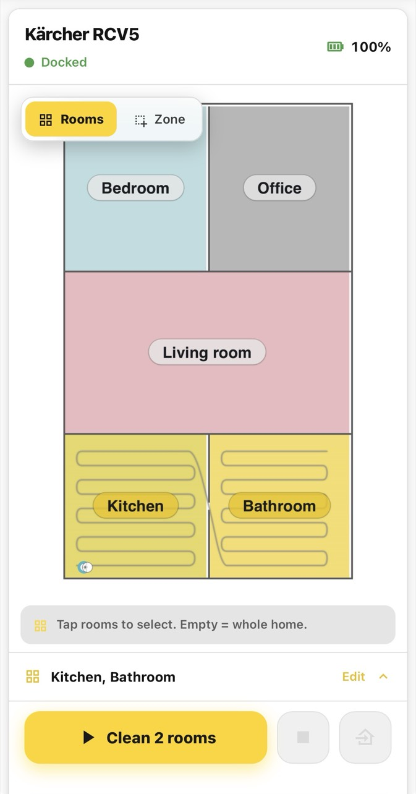

# Kärcher Home Robots — Home Assistant Integration

[](https://hacs.xyz)
[](https://github.com/vosadci/karcher-rcv5-ha/actions/workflows/ci.yml)
[](LICENSE)
[](https://www.home-assistant.io/)

Unofficial community-built integration for **Kärcher robot vacuums**. Provides real-time control and state via the same MQTT/REST cloud protocol the official app uses, with optional **Apple Home support via Matter**. The **RCV 5** is the maintainer's own hardware and the reference the protocol was reverse-engineered from; see [Supported Models](#supported-models) for the rest.

> **Not affiliated with or endorsed by Kärcher or 3iRobotix.** May break with cloud-side changes; use at your own risk.

> **Considering buying an RCV5?** Read [doc/READ_BEFORE_BUYING.md](doc/READ_BEFORE_BUYING.md) first.

**Contents:** [Features](#features) · [Supported Models](#supported-models) · [Requirements](#requirements) · [Installation](#installation) · [Configuration](#configuration) · [Entities](#entities) · [Lovelace Card](#lovelace-card) · [Localization](#localization) · [Apple Home](#apple-home-via-matter) · [Known Limitations](#known-limitations) · [Known Issues](#known-issues) · [Troubleshooting](#troubleshooting) · [Security](#security) · [Contributing](#contributing)

---

## Features

<table>
<tr>
<td></td>
<td></td>
</tr>
</table>

| Feature | Home Assistant | Apple Home |
|---|:---:|:---:|
| Start / Pause / Stop | ✓ | ✓ |
| Return to base | ✓ | ✓ |
| Battery level | ✓ | ✓ |
| Charging state | ✓ | ✓ |
| Locate robot | ✓ | ✓ |
| Room selection | ✓ | ✓ |
| Fan speed (Silent / Standard / Medium / Turbo) | ✓ | ✓ |
| Cleaning mode (Vacuum / Vacuum & Mop / Mop) | ✓ | ✓ |
| Mop water level (Low / Medium / High) | ✓ | ✓ |
| Consumable life sensors (brush, filter, mop pad) | ✓ | — |
| Consumable reset buttons | ✓ | — |
| Suction Station auto-empty (status + manual trigger) | ✓ | — |
| Live floor plan map image with room labels | ✓ | — |
| Custom Lovelace card with room-tap UI | ✓ | — |
| Per-room cleaning preferences (mode, fan speed, order, repeat) | ✓ | — |
| Area cleaning | ✓ | — |
| Per-room progress rings | — | ✓ |
| Localization | ✓ EN · RO · DE · FR · IT · ES · NL | ✓ iOS-native |

---

## Supported Models

The integration talks to the **same 3iRobotix cloud account** used by both the **Kärcher Home Robots** and **Kärcher Indoor Robots** apps. They are different frontends with different supported-model lists, but the cloud device list is shared, so a robot paired through either app can work here.

<!-- BEGIN GENERATED: supported-models -->

| Model | Product ID | Support | Why |
|---|---|---|---|
| **RCV 5** | `1540149850806333440` | ✅ Maintainer-verified | Maintainer's own hardware; the HIL suite runs against it. |
| **RVM 4 Comfort** | `1946123509838999552` | ✅ Community-verified | Community report of working control on this exact product ID. Pairs through the Kärcher Indoor Robots app, same cloud endpoint. |
| **RCV 3** | `1528986273083777024` | 🟡 Expected to work | Shares property-schema template 1483728197182287872 with the RVM 4. |
| **RCF 3** | `1599715149861306368` | 🟡 Expected to work | Shares property-schema template 1483728197182287872 with the RVM 4. |
| **RCV 2** | `1703609713493610496` | 🟡 Expected to work | Shares property-schema template 1483728197182287872 with the RVM 4. |
| **RVC 3** | `1946027907671224320` | 🟡 Expected to work | Shares property-schema template 1483728197182287872 with the RVM 4. |
| **RVC 3 Comfort** | `1946028477060575232` | 🟡 Expected to work | Shares property-schema template 1483728197182287872 with the RVM 4. |
| **RVF 7** | `1950097634462887936` | ⚠️ Uncertain | Own property-schema template 1688471264069652480; adds camera and voice over Agora. |
| **RVF 7 Comfort** | `1950097614355394560` | ⚠️ Uncertain | Own property-schema template 1688471264069652480; adds camera and voice over Agora. |
| **RCV 3 (JP)** | `1670775876502392832` | ⚠️ Uncertain | Known from the vendor app only; absent from the live catalog, so no template. |
| **RCV 5 (JP)** | `1670774796888543232` | ⚠️ Uncertain | Known from the vendor app only; absent from the live catalog, so no template. |

**Every model above gets the full entity set.** The support level says how much evidence we have that it works — it does not withhold features.

- ✅ Maintainer-verified — the maintainer owns this robot and the hardware test suite runs against it.
- ✅ Community-verified — a user reported working control on this exact product ID.
- 🟡 Expected to work — Kärcher's backend puts this model on the same property schema as a verified one, so its properties should behave the same. Untested.
- ⚠️ Uncertain — no shared-schema evidence either way. Setup works and every entity appears; individual values may be wrong.

**A robot that is not listed at all still sets up** and gets the full entity set — it registers under its raw product ID. Home Assistant will show a notice under **Settings → System → Repairs** with that ID; please open an issue quoting it so the model can be added. Models marked uncertain above get a similar notice asking whether they work. Nothing is withheld either way, and both notices disappear once the model is settled.

<!-- END GENERATED: supported-models -->

Every robot on your account sets up independently.

**Adding a model** takes one row in `custom_components/karcher_home_robots/_model_profile.py` — your product ID and "it works for me" are enough. Open an issue with the product ID from your diagnostics download, or a pull request with the row.

---

## Requirements

- **Home Assistant** 2026.9.0 or newer
- **A Kärcher app account** — **Home Robots** or **Indoor Robots**, EU, US, or CN region. Both share one cloud device list, so either works.
- **2.4 GHz Wi-Fi** reachable by the vacuum (the firmware does not support 5 GHz)
- **Apple Home** (optional): [Home Assistant Matter Hub](https://github.com/RiDDiX/home-assistant-matter-hub) v2.0.56 or newer and iOS/tvOS 26 or newer

> Earlier versions of these dependencies may work but have not been tested.

---

## Installation

### HACS — Custom Repository (recommended)

1. In Home Assistant, open **HACS → Integrations**.
2. Click the **⋮** menu in the top-right corner and choose **Custom repositories**.
3. Enter `https://github.com/vosadci/karcher-rcv5-ha` and set the category to **Integration**.
4. Search for **Kärcher Home Robots** and click **Download**.
5. Restart Home Assistant.

### Manual

1. Download or clone this repository.
2. Copy the `custom_components/karcher_home_robots/` folder into your Home Assistant configuration directory:

```bash
cp -r custom_components/karcher_home_robots /config/custom_components/
```

3. Restart Home Assistant.

---

## Configuration

After restarting, go to **Settings → Devices & Services → Add Integration** and search for **Kärcher Home Robots**. The setup wizard has three steps:

| Step | What to enter |
|---|---|
| **Region** | EU, US, or CN — must match the region of your Kärcher app account |
| **Credentials** | Email and password for that account |
| **Device** | Pick your robot from the list (skipped if the account holds only one) |

The integration authenticates, subscribes to MQTT push updates, and creates all entities automatically. No YAML configuration is required.

### Running multiple robots

Each robot requires its own config entry. Run **Add Integration** once per robot. If they share an account, use the same credentials and pick a different device at the last step.

### Reauthentication

Token expiry is handled transparently. A **Reauthentication required** prompt only appears when the password itself is invalid (changed in the app, account locked, etc.). Go to **Settings → Devices & Services → Kärcher Home Robots → Reauthenticate** — region and device selection are preserved.

---

## Entities

Each robot is one device — its page in Home Assistant lists every entity with live values. Entity IDs follow `<domain>.<robot>_<suffix>`, using the nickname set in the Kärcher app.

- **Vacuum** — start, pause, stop, dock, locate, fan speed
- **Sensors** — battery, cleaning area and time, current room, robot status, and four consumable lives: main brush, side brush, `hypa` (the filter), mop pad
- **Buttons** — reset each consumable after replacement; trigger a Suction Station empty
- **Binary sensors** — charging, error, connectivity, station attached, emptying
- **Selects** — room, cleaning mode, water level
- **Map** — `image.<name>_map`, the live floor plan as a PNG
- **Per room** — `select.<name>_room_<room>_` + `mode`, `power`, `water`, `repeat`, plus `number.<name>_room_<room>_order` and `switch.<name>_room_<room>_custom`. These appear as rooms are discovered.

**Robot status** (`sensor.<name>_robot_status`) reports named fault states — "Dust box full", "LiDAR timeout" — and no fault when idle.

**Room selection.** Rooms are loaded from the robot's stored map at startup. Select a room and press Start to clean only that room; select "All rooms" to clean everything. The selection applies to the next start only — it is consumed when cleaning begins and the entity resets to "All rooms". This keeps `vacuum.start` whole-home for external callers (automations, voice assistants, Apple Home via HAMH). The room list updates automatically whenever the robot builds a new map.

**Mop attachment gating.** Cleaning modes that require the mop (Vacuum & Mop, Mop) are blocked unless the water tank and mop cloth are both physically installed. The water level selector is unavailable in Vacuum-only mode.

**Services.** Three services go beyond the standard `vacuum.*` ones, for automations:

| Service | What it does |
|---|---|
| `karcher_home_robots.set_room_selection` | `room_ids` — the rooms the next Start will clean |
| `karcher_home_robots.set_room_preference` | `room_order` — the order rooms are cleaned in (per-room mode, suction and water level are entities, not this service) |
| `karcher_home_robots.refresh_preferences` | Re-read the per-room settings from the robot |

Each also takes an optional `device_id` to pick a robot when you run more than one.

**Diagnostics.** Go to **Settings → Devices & Services → Kärcher Home Robots → ⋮ → Download diagnostics**. The output is automatically redacted of credentials, tokens, device identifiers, and serial numbers.

---

## Lovelace Card

The integration ships a custom map card — no separate HACS step required. The card resource is registered automatically on first startup.

> **YAML resource mode:** If your Lovelace configuration uses `resource_mode: yaml`, add the resource manually: URL `/karcher_home_robots/static/karcher-vacuum-card.js`, type `JavaScript Module`.

### Add to a dashboard

In the dashboard editor, click **Add card**, search for **Kärcher Vacuum Card**, and pick your vacuum entity. That is the whole setup — the card derives every companion entity (battery, map, current room, cleaning time and area, cleaning mode, water level, error, robot status) from the vacuum entity's stem, e.g. `vacuum.karcher_rcv5` → `sensor.karcher_rcv5_battery`, `image.karcher_rcv5_map`.

The visual editor also sets the card height and an opt-in debug footer showing the loaded card version, HA version, state and map size — useful for confirming which card build a browser actually loaded, past the resource cache.

If one of your entities was renamed away from the standard `<domain>.<stem>_<suffix>` pattern, open **Advanced — entity overrides** in the editor and point that one entity at the right entity_id.

On a YAML-mode dashboard, where the visual editor is unavailable, the same card is:

```yaml
type: custom:karcher-vacuum-card
vacuum_entity: vacuum.karcher_rcv5
```

Every editor field has a YAML key: `card_height`, `show_debug`, and one `<name>_entity` key per companion entity (`battery_entity`, `map_entity`, `current_room_entity`, …).

### Card capabilities

- Renders the live floor plan; refreshes automatically when the map updates
- Pinch to zoom, drag to pan once zoomed (ctrl/trackpad scroll on desktop), with a reset-zoom button
- Room pills on the map are labelled with the room name; the room list below shows each room's mapped area (m²)
- A floating **Rooms / Zone** control on the map switches what a drag does
- **Rooms** — tap a room to select it (highlights); tap again to deselect; **Start** cleans the selected rooms, or the whole home if none are selected
- **Zone** — drag a rectangle on the map, then press Start to clean just that area
- **Customise tab**, in the sheet below the map — set per-room cleaning order, mode, fan speed, water level, repeat passes, and custom-settings toggle; drag to reorder rooms
- The active tab (Standard / Customise) is persisted on the robot and restored automatically on page reload, matching the behaviour of the official Kärcher app
- State-aware control buttons: Play/Pause · Stop · Dock · Locate
- Fan speed and cleaning mode selectors (fan speed is disabled in Mop-only mode)
- Mop water level selector (disabled in Vacuum-only mode)
- Battery level, status line (including the current room), and three stat tiles: cleaned area, duration, and when the last run finished
- Error banner when the robot reports a fault, showing the specific fault description (e.g. "Bumper fault") rather than a generic message

---

## Localization

**In Home Assistant**, this integration ships **English, Romanian, German, French, Italian, Spanish, and Dutch**. Home Assistant uses your account language automatically — there is nothing to configure. Translations cover the setup and re-authentication flow, entity names and states (including the 50+ robot fault and status messages), repair notifications, and the custom Lovelace card (buttons, status line, map legend, room list, and settings sheet — the card follows your Home Assistant language). All languages are kept complete and in sync, enforced in CI.

**In Apple Home**, the interface is localized by iOS itself: the standard robot-vacuum controls and mode names appear in your device's system language, so Apple Home is translated regardless of this integration (and is not limited to the languages above).

The only text that is never translated is your **room names** — they come from your Kärcher account and appear exactly as you named them in the Kärcher app, in both Home Assistant and Apple Home.

Contributions of additional Home Assistant languages are welcome — see [Contributing](#contributing).

---

## Apple Home via Matter

Requires [Home Assistant Matter Hub](https://github.com/RiDDiX/home-assistant-matter-hub) (HAMH) and **iOS/tvOS 26 or newer**. Tested against HAMH **v2.0.56**; earlier versions may work but have not been tested.

### Bridge setup (one-time)

In the HAMH web UI, create a new bridge:

1. Give it any name (e.g. `Kärcher RCV5`).
2. Enable **Server Mode**.
3. Add your vacuum entity (e.g. `vacuum.karcher_rcv5`) to the entity filter.
4. Click the vacuum row and set **Matter Device Type** to **Robot Vacuum Cleaner**.
5. Map the optional entities:
   - **Cleaning Mode** → `select.<name>_cleaning_mode`
   - **Mop Intensity** → `select.<name>_water_level`
   - **Current Room** → `sensor.<name>_current_room`

### Map rooms to Home areas (one-time, enables room picker)

For the Apple Home room picker to work, each vacuum room must be mapped to a Home Assistant area:

1. In Home Assistant, go to **Settings → Devices & Services → Entities** and open `vacuum.<name>`.
2. In the entity detail, find **Vacuum area mapping** and click **Configure**.
3. Assign each room reported by the robot to a matching Home Assistant area (create areas first if needed).

HAMH reads this mapping at startup and exposes the rooms as selectable areas in Apple Home. Without it the room picker is not shown.

### Pair with Apple Home (one-time)

HAMH shows a Matter QR code. In the **Home** app, tap **Add Accessory → More Options** and scan it.

### What appears in Apple Home

- Start / Stop / Return to Base
- Locate — plays a sound on the robot to find it (Home app *Identify*)
- Battery percentage
- Room picker — select one or more rooms before pressing Start
- Fan speed: Quiet / Automatic / Max
- Cleaning type: Vacuum / Mop / Vacuum and Mop
- Mop intensity: Quiet / Automatic / Max (visible when a mop mode is active)
- Per-room progress rings: each selected room shows a spinner while being cleaned, then a filled ring when complete

---

## Known Limitations

- **Cloud-only.** These robots have no local API; all control goes through the 3iRobotix cloud. An internet outage or vendor-side maintenance will make the robot unreachable from Home Assistant.
- **One robot per config entry.** Multi-robot accounts are supported but require adding the integration once per robot.
- **Map requires a completed clean.** The robot only uploads its floor plan after finishing a full cleaning cycle. Run one complete clean before expecting the map image or room list to appear.
- **2.4 GHz Wi-Fi only.** The firmware does not connect to 5 GHz.
- **No schedule management.** Cleaning schedules can only be set in the Kärcher app; they are not exposed as Home Assistant entities.
- **No custom-path cleaning, and no-go zones are read-only.** Whole-home, per-room and drawn-area cleaning all work; a no-go zone is drawn on the map but can only be edited in the Kärcher app.

---

## Known Issues

**Apple Home: room progress rings mark a transit room as cleaned.**
A room the robot merely passes through can show as "cleaned" in Apple Home, because HAMH's progress rings are driven by robot position (the `current_room` sensor), not by actual floor coverage. No fix available yet.

---

## Troubleshooting

**Login fails with the correct password.**
Check the region setting. Accounts are region-bound — an EU account will not authenticate against the US endpoint. If the region is correct, try logging in through the Kärcher Home Robots app to verify the credentials.

**`Reauthentication required` banner appears.**
The saved password is no longer valid. Go to **Settings → Devices & Services → Kärcher Home Robots → Reauthenticate** and enter the current password. The integration handles normal token expiry automatically; you only see this prompt when the credentials themselves have changed.

**Setup fails because a device could not be parsed.**
One of the robots on your Kärcher account returned a device record the integration's cloud library could not read, which blocks setup for *every* robot on that account — the whole device list has to parse before any robot is set up. Please open an issue and attach your diagnostics.

**Entities go unavailable.**
The 3iRobotix cloud is unreachable. The integration recovers automatically when the connection is restored — no user action is needed. After one hour of continuous unavailability, a **repair** issue appears in Home Assistant with details; it dismisses itself on the next successful poll.

**Room list is empty.**
Run a complete cleaning cycle so the robot builds and uploads its map. The room list populates on the next successful update after the cycle finishes.

**Fan speed shows as unavailable.**
This is expected when Mop-only cleaning mode is selected — the robot has no suction in that mode.

**Map image does not update.**
The map image refreshes on dock and every 10 s during active cleaning. If it never appears, check that the robot has completed at least one full clean (see above) and that `image.<name>_map` is enabled in the entity registry.

**Card shows the wrong entity, or a field stays empty.**
The card auto-derives every entity from `vacuum_entity`'s stem (see [Lovelace Card](#lovelace-card)); this fails if an entity was renamed away from the standard `<domain>.<stem>_<suffix>` pattern. Set the matching `_entity` override key in the card config to point at the correct entity_id.

For anything not covered here, download diagnostics (**Settings → Devices & Services → Kärcher Home Robots → ⋮ → Download diagnostics**) and attach them when opening an issue.

---

## Security

- **REST is certificate-pinned.** Every cloud API call is checked against a hardcoded SHA-256 fingerprint of the 3iRobotix server certificate; no CA and no system trust store is consulted, and there is no fallback.
- **MQTT is encrypted but not authenticated.** The `karcher-home` library connects to the broker with certificate verification disabled (`karcher/mqtt.py`, `# TODO validate certificate`). Traffic is encrypted; the server's identity is not checked. This integration's own code never disables verification, but it drives that client, so the limitation is real. See [doc/LIBRARY.md](doc/LIBRARY.md).
- Credentials, tokens, serial numbers, and MQTT payloads are never logged above the `DEBUG` level.
- No telemetry is sent anywhere other than the vendor cloud the robot itself communicates with.

To report a vulnerability privately, see [SECURITY.md](.github/SECURITY.md).

---

## Contributing

Adding a robot model takes one row in one file — or just an issue with the
product ID, if you would rather not open a PR. See
[CONTRIBUTING.md](CONTRIBUTING.md).

- [CONTRIBUTING.md](CONTRIBUTING.md) — adding a model, support tiers, dev setup, PR expectations
- [ARCHITECTURE.md](ARCHITECTURE.md) — module map, layer rules, error taxonomy
- [doc/LIBRARY.md](doc/LIBRARY.md) — the pinned cloud-protocol library: risk, fork triggers, TLS posture
- [CLAUDE.md](CLAUDE.md) — development commands and constraints

---

## Acknowledgements

- [`karcher-home`](https://github.com/lafriks/karcher-home) by [@lafriks](https://github.com/lafriks) — underlying cloud-protocol library
- [Home Assistant Matter Hub](https://github.com/RiDDiX/home-assistant-matter-hub) by [@RiDDiX](https://github.com/RiDDiX) — Apple Home bridge

---

## Licence

MIT — see [LICENSE](LICENSE).

*Not affiliated with Kärcher SE & Co. KG or 3iRobotix Co., Ltd. All trademarks are the property of their respective owners.*
